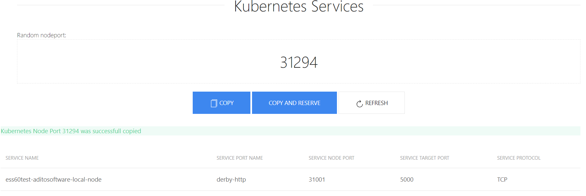

# Kubernetes Portgen

This is a simple example app for kubernetes, that generate a random k8s [nodePort](https://kubernetes.io/docs/concepts/services-networking/service/#nodeport).

The frontend is created with [vue.js](https://vuejs.org) (folder client) and backend was created with [express](http://expressjs.com/de/) (folder server) 

## Run app without docker
0. Define environment variables
1. Start client 
  - go in folder client
  - run "npm i"
  - run "npm run dev"
  - change url for server in src/components/Index.vue 
The site is accessible on url http://localhost:8080
2. Start server
  - go in folder server
  - run "npm i"
  - run "node index.js" 
Server will be runnning on port 8081

## Run app with docker

1. Install docker
2. Run command
````
sudo docker run -d -p 8080:8080 -e PORT=8080 -e K8SURL=server.com -e K8SPORT=6443 -e K8STIMEOUT=30 -e RESSPATH=/api/v1/services -e K8STOKEN=BEARERTOKEN-FROM-K8S -e K8SPORTSTART=30000 -e K8SPORTEND=32000 --name portgen -t de1m/k8s-nodeport-gen
````

## Kubernetes Deploy
### Deployment
```[yaml]
apiVersion: apps/v1beta1 # for versions before 1.6.0 use extensions/v1beta1
kind: Deployment
metadata:
  namespace: internal
  name: portng.example.com
spec:
  replicas: 1
  template:
    metadata:
      labels:
        app: portng.example.com
    spec:
      serviceAccountName: portng-service-get
      containers:
      - name: portgen
        image: de1m/k8s-nodeport-gen
        env:
        - name: K8SURL
          value: k8s-server.example.com
        - name: K8SPORT
          value: '6443'
        - name: K8STIMEOUT
          value: '30'
        - name: RESSPATH
          value: '/api/v1/services'
        - name: K8SPORTSTART
          value: '30000'
        - name: K8SPORTEND
          value: '32000'
        - name: PORT
          value: '8080'
        args:
        - /bin/sh
        - -c
        - export K8STOKEN=$(cat /var/run/secrets/kubernetes.io/serviceaccount/token) && node /portgen/index.js
```
### Service account and role binding
```
# RBAC authn and authz
apiVersion: v1
kind: ServiceAccount
metadata:
  name: portng-service-get
  namespace: internal
  labels:
    k8s-app: portng-service-get
    kubernetes.io/cluster-service: "true"
---
kind: ClusterRoleBinding
apiVersion: rbac.authorization.k8s.io/v1
metadata:
  namespace: internal
  name: view
  labels:
    k8s-app: portng-service-get
    kubernetes.io/cluster-service: "true"
    addonmanager.kubernetes.io/mode: Reconcile
subjects:
- kind: ServiceAccount
  name: portng-service-get
  namespace: internal
  apiGroup: ""
roleRef:
  kind: ClusterRole
  name: view
  apiGroup: ""
```

You need also a kubernetes service. Also I have an [ingresss controller](https://github.com/kubernetes/ingress-nginx) and ingress configuration for this deployment.  

## Environment variables

**K8SURL** - DNS name for k8s cluster  
**K8SPORT** - api port of k8s cluster  
**K8STIMEOUT** - request timeout (default 30sec.)  
**RESSPATH** - api path to services (/api/v1/services)  
**K8STOKEN** - api token (Bearer)  
**K8SPORTSTART** - nodePorts range start number(default 30000)  
**K8SPORTEND** - nodePorts range end number(default 32000)  

**PORT** - backend server http port (default 8081)  
